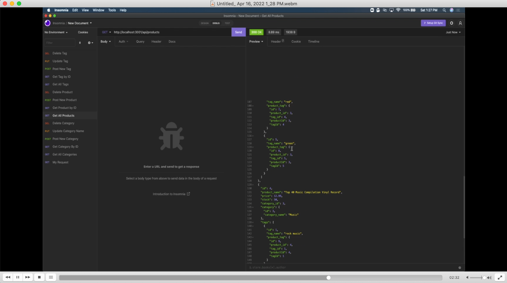

# ECommerce BackEnd

## My Task

Internet retail, also known as **e-commerce**, is the largest sector of the electronics industry, generating an estimated $29 trillion in 2019. E-commerce platforms like Shopify and WooCommerce provide a suite of services to businesses of all sizes. Due to their prevalence, understanding the fundamental architecture of these platforms will benefit you as a full-stack web developer.

My task was to build the back end for an e-commerce site by modifying starter code.

## User Story

```md
AS A manager at an internet retail company
I WANT a back end for my e-commerce website that uses the latest technologies
SO THAT my company can compete with other e-commerce companies
```

## Mock-Up

The following video shows an example of the application being used from the command line and in Insomnia:

[](https://drive.google.com/file/d/1CW3WEeOdsI30YH3ZBuDNMd9dErl0rVWF/view?usp=sharing)

## Technology

* Javascript
* Node.js
* Express
* MySQL

## Links

* Github Repo: https://github.com/anthonypacella/eCommerceBackEnd